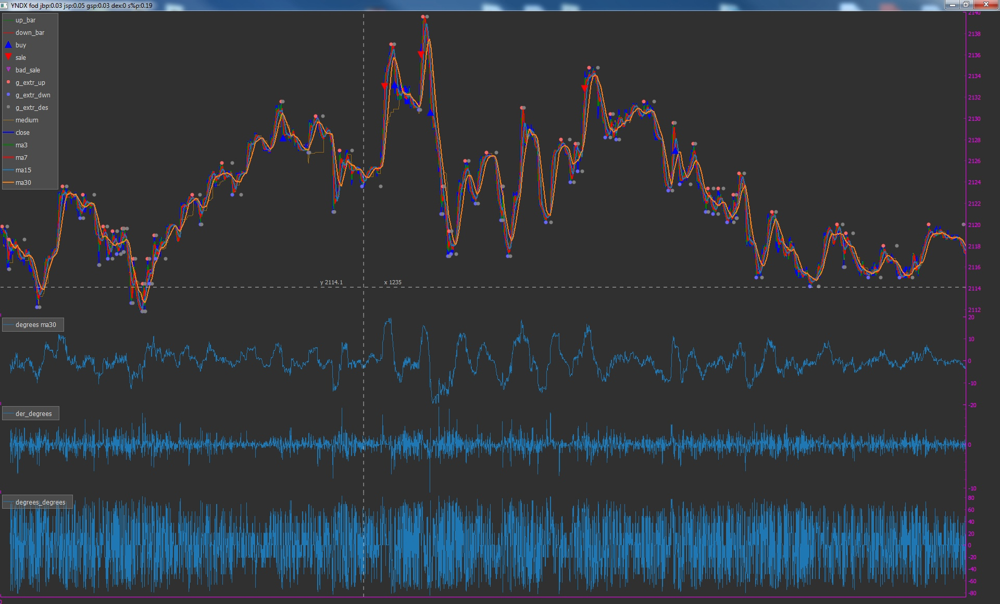
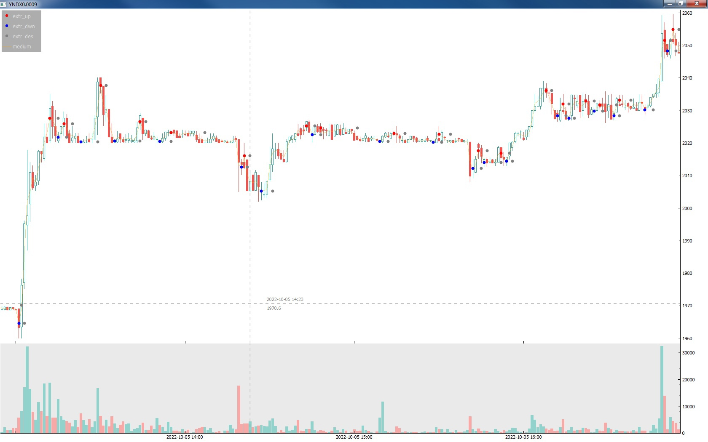
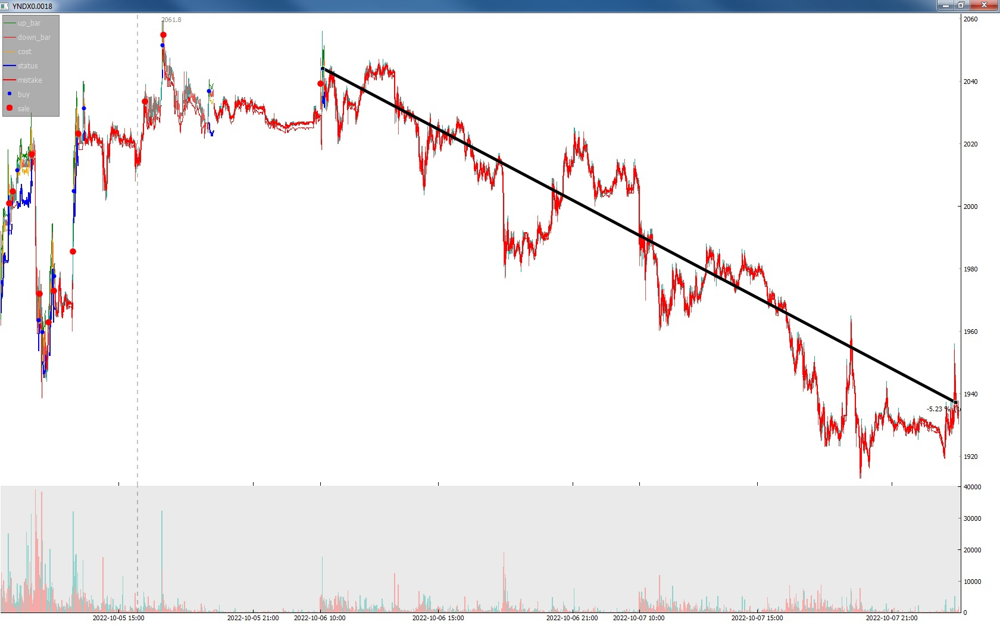
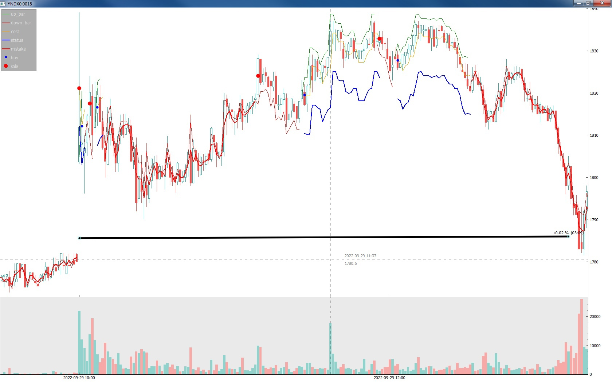
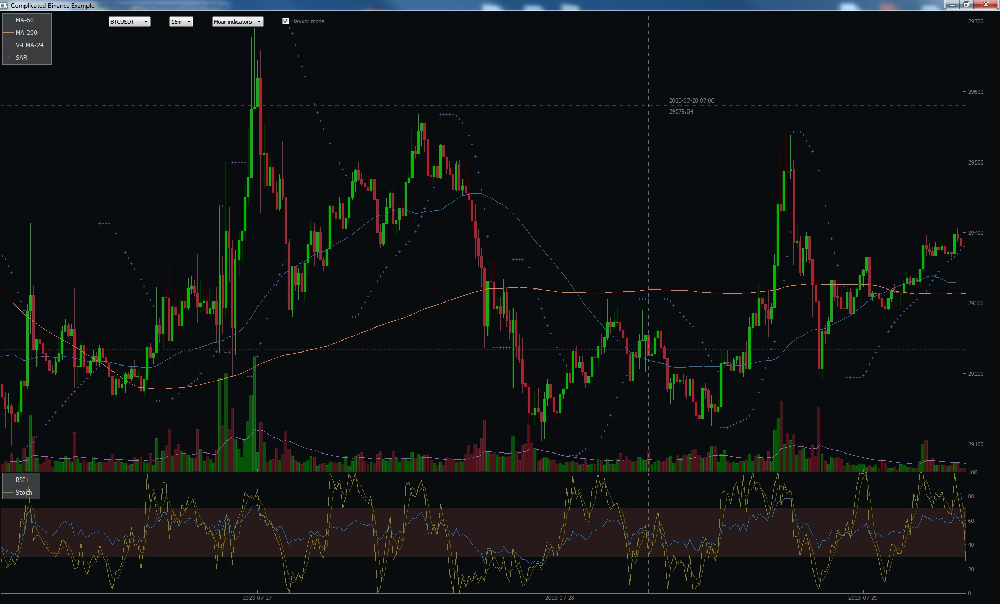
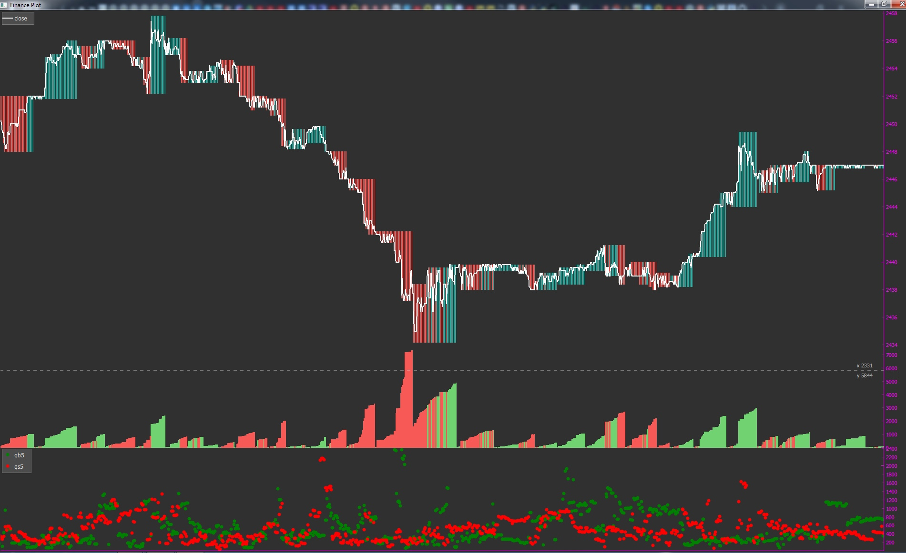

Это первый давний мой крупный проект, создаваемый для себя, поэтому за качество кода несколько стыдно)
Для запуска и работы робота требуются аккаунт Тинькофф Инвестиций и создание токенов доступа для API.
Использование и скрытие токенов реализовано через переменные среды Windows.
Проект в большей его части это инструмент технического анализа и предсказания поведения фондовых рынков в реальном времени
или получения, обработки и анализа исторических данных.
По скачиваемым данным и анализу строятся разнообразные интерактивные графики, которые аналогичны стандартным графикам
торгового терминала или превосходят их по функциональности.
Реализовано управление через командную строку.
Разработано несколько роботов, способных принимать решения о покупке или продаже активов и исполнять их.
Написана среда тестирования этих роботов в реальном времени или на исторических данных, для проверки системы без использования реальных активов.
Возможна работа как с торговыми свечами фиксированного временного интервала, так и со свечами длительностью меньше секунды,
которые каждую секунду поступают в неопределённом количестве и, вероятно, перепутанные местами.
Скриншоты ниже показывают интерактивные возможности, разнообразие типов графиков и компоновок, количество вариантов анализа, решения роботов.

